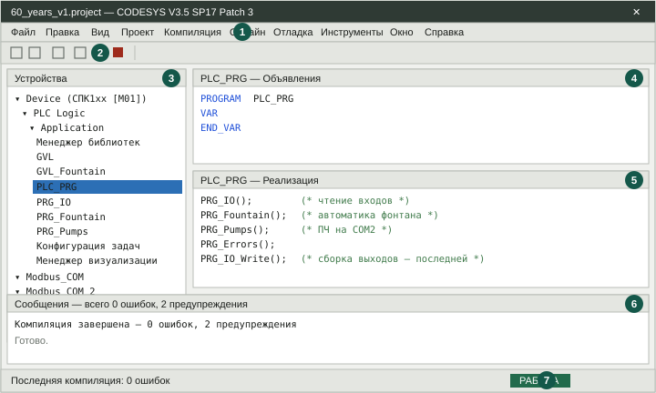
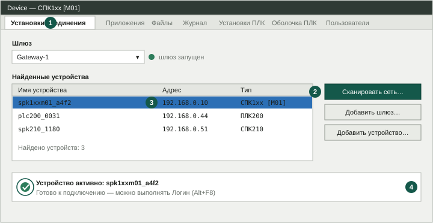
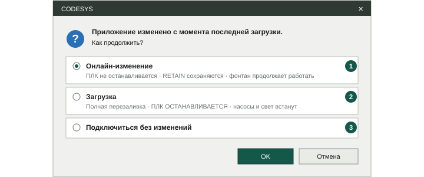
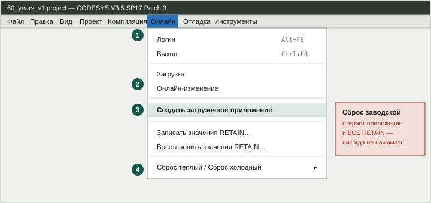
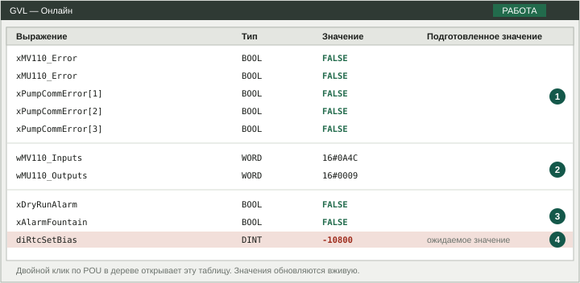
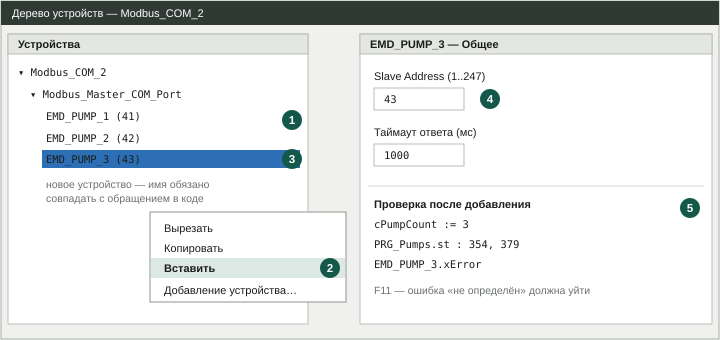

# ВЫЕЗД НА ОБЪЕКТ — порядок работ в CODESYS

Полный регламент выезда. Каждый шаг: что нажать, где это находится,
что должно произойти и что делать, если пошло не так. Ничего не
подразумевается по умолчанию — чтобы работу можно было выполнить,
не держа проект в голове и не созваниваясь по ходу дела.

Объект: фонтан на контроллере **ОВЕН СПК107 [М01]** (сенсорная панель +
ПЛК в одном корпусе), прошивка **2.4**, среда
**CODESYS V3.5 SP17 Patch 3**.

---

## ⚠️ ПЕРЕД ВЫЕЗДОМ — СВЕРИТЬ КОМПЛЕКТНОСТЬ ПО [SETUP.md](SETUP.md)

**Это первое, что нужно сделать, и делается это дома, а не на объекте.**

В [SETUP.md](SETUP.md) — пронумерованный список всего, что должно быть
установлено: среда, таргет-файлы, драйвер USB, внешние библиотеки,
встроенные библиотеки, утилиты, документация. Пройти список сверху вниз
и отметить, чего не хватает.

Отдельно проверить **две вещи, которые чаще всего забывают**:

1. **Библиотеки подключены в самом проекте**, а не только установлены в
   среде. Это разные действия и разные места — см. [SETUP.md](SETUP.md),
   раздел «Куда что подключается». Открыть `Менеджер библиотек` в дереве
   и сверить состав с пунктами 6–10.
2. **F11 даёт 0 ошибок дома.** Если проект не собирается на своей
   машине, на объекте он не соберётся тем более, а времени там нет.

Если на месте всплывёт нехватка компонента, которого нет в
[SETUP.md](SETUP.md) — дописать его туда, чтобы следующий выезд был
чище.

---

## ЧАСТЬ 0. ЧТО ВЗЯТЬ С СОБОЙ

**Обязательно:**
- Ноутбук с установленным CODESYS + таргет-пакетом ОВЕН (проверить
  ДОМА, а не на объекте!)
- Файл проекта `.project` — **на ноутбуке локально**, не только в облаке
- Кабель **USB A ↔ USB B** (или micro-USB — зависит от исполнения СПК)
  и/или **патч-корд Ethernet**
- Флешка с дистрибутивами (интернета на объекте может не быть)
- SD-карта **FAT32, разметка MBR** — запасная, для журналов

**Желательно:**
- Отвёртка плоская 2,5 мм (клеммники ОВЕН)
- Мультиметр (проверить, есть ли реально 24 В на входе)
- Телефон с фото шкафа ДО того, как вы что-то трогали
- Распечатка карты DI/DO (см. `60-let-oktyabrya/docs/LOGIC.md`)

**Правило №1 перед выездом:** открыть проект дома, нажать F11
(компиляция), убедиться, что **0 ошибок**. Если проект не собирается
дома — на объекте он не соберётся тем более, а времени там нет.

---

## ЧАСТЬ 1. ЧЕГО НЕЛЬЗЯ ДЕЛАТЬ НИКОГДА

| Действие | Что случится |
|---|---|
| `Онлайн → Сброс заводской` (Reset origin) | Стирает приложение И все RETAIN: наработки, счётчики промывок, уставки ПЧ, журналы. Восстановить нечем |
| Шить прошивку «на всякий случай» | Контроллер после Х/2022 откатить назад нельзя. Риск окирпичить |
| Дёргать клеммники под напряжением | 220 В на реле МУ110 |
| Загружать проект, не сохранив старую версию | Не будет отката |
| Менять `ePumpType` без последующего `Сброс холодный` | Массив RETAIN не перечитается, ПЧ будет обрабатываться по чужому типу |

**Правило №2:** перед первой загрузкой на работающем объекте — выгрузить
из контроллера то, что там сейчас, или хотя бы записать версию
приложения. Если новая версия сломает фонтан, надо иметь чем вернуться.

---

## ЧАСТЬ 2. КАК УСТРОЕНО ОКНО CODESYS

Схемы ниже — **рисованные, а не снимки экрана**: они показывают, где
что лежит, а не как выглядит конкретная сборка. Настоящие скриншоты
есть в PDF ОВЕН
«[Первый старт CODESYS V3.5](https://ftp.owen.ru/CoDeSys3/11_Documentation/03_3.5.11.5/CDSv3.5_FirstStart_v3.0.pdf)»
и «[Первый старт СПК](https://ftp.owen.ru/CoDeSys3/11_Documentation/01_SPK/SPK_First_start_v.1.0.pdf)» —
их стоит держать рядом при работе.



**Рис. 1.** Главное окно CODESYS с открытым проектом фонтана

1. Строка меню. Чаще всего нужны четыре раздела: **Файл**, **Компиляция**, **Онлайн**, **Отладка**.
2. Панель инструментов: сохранить, компилировать, логин, старт, стоп.
3. Панель **«Устройства»** — дерево проекта. Если её не видно: `Вид → Устройства`.
4. Окно **«Объявления»**: `PROGRAM` и блоки `VAR … END_VAR`.
5. Окно **«Реализация»** — сам код. Файлы `.st` из репозитория ложатся сюда.
6. Панель **«Сообщения»** — результат компиляции. Здесь ищут ошибки.
7. Состояние контроллера: **РАБОТА** или **СТОП**.


### Верхнее меню (слева направо)

| Раздел (RU) | Раздел (EN) | Что вам оттуда нужно |
|---|---|---|
| **Файл** | File | Открыть проект, Сохранить, **Архив проекта** |
| Правка | Edit | Найти/Заменить |
| Вид | View | Вернуть закрытые панели (Устройства, Сообщения) |
| Проект | Project | Добавление объектов, Настройки проекта |
| **Компиляция** | Build | **Компилировать (F11)**, Перекомпилировать всё, Очистить |
| **Онлайн** | Online | **Логин (Alt+F8)**, Выход, Загрузка, **Создать загрузочное приложение**, Сброс |
| **Отладка** | Debug | **Старт (F5)**, **Стоп**, точки останова |
| **Инструменты** | Tools | Опции, CODESYS Installer, Репозиторий библиотек, Настройка устройств |
| Окно | Window | Переключение вкладок |
| Справка | Help | — |

Ниже меню — **панель инструментов** (иконки). Самые нужные:
- 🖫 дискета — сохранить
- ⚙ шестерёнка / «кубик» — компилировать (то же, что F11)
- 🔌 вилка/штекер — **Логин** (подключиться к ПЛК)
- ▶ зелёный треугольник — **Старт (F5)**
- ⏹ красный квадрат — **Стоп**

### Левая панель — «Устройства» (Devices)

Дерево объекта. Раскрывается треугольничками. Выглядит так:

```
Device (СПК1хх [М01])          ← сам контроллер, двойной клик = настройки связи
├── PLC Logic
│   └── Application            ← ваша программа
│       ├── Менеджер библиотек
│       ├── GVL                ← глобальные переменные (Modbus, ПЧ)
│       ├── GVL_Fountain       ← глобальные переменные фонтана
│       ├── PLC_PRG            ← главная программа
│       ├── PRG_IO, PRG_Fountain, PRG_Pumps, PRG_Errors …
│       ├── FB_Pump, FB_SunsetRelay, …
│       ├── Конфигурация задач
│       │   └── MainTask → PLC_PRG
│       └── Менеджер визуализации  ← экраны панели
├── Modbus_COM      (COM1, 9600) ← МВ110 (адр.1), МУ110 (адр.2)
└── Modbus_COM_2    (COM2, 38400) ← ПЧ EMD_PUMP_1/2/3 (адр.41/42/43)
```

Если панели нет — `Вид → Устройства`.

### Нижняя панель — «Сообщения» (Messages)

Сюда падают результаты компиляции: `0 ошибок, 0 предупреждений`.
Если панели нет — `Вид → Сообщения`.

### Как открыть код

Двойной клик по имени POU в дереве (например `PRG_Fountain`).
Окно делится пополам:
- **верх — «Объявления»**: `PROGRAM ...`, блоки `VAR ... END_VAR`
- **низ — «Реализация»**: сам код

Файлы `.st` из этого репозитория — это **содержимое обеих частей**.
Строку `END_PROGRAM` вставлять не надо, среда её ставит сама.

---

## ЧАСТЬ 3. ПРИЕХАЛИ НА ОБЪЕКТ — ЧТО ДЕЛАТЬ ПО ПОРЯДКУ

### Шаг 1. Осмотр ДО того, как открыть ноутбук (10 минут)

1. Сфотографировать шкаф целиком и каждый ряд клемм.
2. Посмотреть на **лицевую панель СПК**: он работает? Экран горит?
   Какой экран открыт? Есть ли красные лампы аварий?
3. Записать, что показывает главный экран: текст аварий
   (`sAlarmCauses`), состояние насосов, света, сухого хода.
4. Посмотреть на модули:
   - **МВ110-16Д** (входы) — светодиоды «RS-485» должны мигать
   - **МУ110-16Р** (выходы) — светятся те выходы, что включены
   - Не мигает RS-485 → нет опроса по COM1, дальше искать там
5. Посмотреть на **ПЧ EMD-PUMP** (3 шт.): дисплеи горят, кодов
   аварий нет.
6. Проверить, стоит ли **SD-карта** в СПК (журналы аварий пишутся туда).
7. Записать текущее время на экране СПК и сверить с телефоном.
   Проект сам корректирует уход RTC (см. Часть 6).

### Шаг 2. Подключение ноутбука к контроллеру

Два варианта — выбрать один.

**Вариант А — по USB (проще, ничего настраивать не надо):**
1. Драйвер USB (`USB_Driver_v.1.5.102`) должен быть установлен ЗАРАНЕЕ.
2. Воткнуть USB-кабель в разъём на СПК (обычно снизу/сбоку).
3. В Диспетчере устройств Windows появится новый сетевой адаптер.

**Вариант Б — по Ethernet:**
1. Патч-корд ноутбук ↔ СПК (или в тот же коммутатор).
2. Узнать IP контроллера: на самом СПК зайти в **сервисное меню**
   (обычно долгое удержание пальца в углу экрана или отдельная кнопка
   «Сервис» в вашей визуализации).
3. Ноутбуку дать IP из той же подсети (например, ПЛК `192.168.0.10`
   → ноутбуку `192.168.0.100`, маска `255.255.255.0`).
4. Проверить: `ping 192.168.0.10` — должен отвечать.

### Шаг 3. Открыть проект

`Файл → Открыть проект…` → выбрать ваш `.project`.

Если открывается **архив** `.projectarchive` — `Файл → Архив проекта →
Извлечь архив…`.

При открытии выскакивают окна. **Их два, и ведут себя они
противоположно — не перепутать.**

**Окно «Среда проекта» → закладка «Незаданный плейсхолдер».**
Длинный список библиотек с колонками «Плейсхолдер / Рекомендуется /
Действие». Проект ссылается на библиотеки без привязки к версии, и
CODESYS просит эту привязку сделать.

→ **Нажать `OK`.** Плейсхолдеры обязаны быть разрешены, иначе проект
не соберётся. В колонке «Действие» уже стоит нужное.

⚠️ **Не нажимать «Сделать все новейшими»**: у библиотеки `CmpErrors`
рекомендована версия 3.3.1.40, а не 3.5.17.0, и эта кнопка затрёт
корректную рекомендацию.

**Окно «Обновление версий устройств и библиотек».** Предлагает поднять
версии на более новые.

→ **Ничего не обновлять**, если специально не собирались: «Не
обновлять» или снять галочки. Обновление версии таргета тянет
пересборку всего дерева.

Разница простая: первое окно **привязывает** версии (без этого никак),
второе — **меняет** их (без этого прекрасно живётся).

### Шаг 4. Компиляция (проверка, что код собирается)

1. Нажать **F11** (или `Компиляция → Компилировать`).
2. Смотреть в нижнюю панель **«Сообщения»**.
3. Нужно увидеть: **`Компиляция завершена — 0 ошибок, N предупреждений`**.

**Предупреждения (warnings) — можно жить.** **Ошибки (errors) —
загружать нельзя.**

**Если ошибки про неизвестные типы и функции** — `SysTimeRtcGet`,
`FILE.CAA.HANDLE`, `TON`, `WCONCAT`, `LoginOnlyPassWithKeysOwen` — это
не проблема кода, а неподключённая библиотека. Открыть
`Менеджер библиотек` в дереве и сверить состав с
[SETUP.md](SETUP.md), пункты 6–10. Там же, в разделе «Куда что
подключается», описано, куда именно каждая библиотека подключается:
внешние — в двух местах, встроенные — в одном, системные `Sys*` видны
только после нажатия «Дополнительно…» в окне добавления.

Отдельный случай — **МВ110 или МУ110 нет в списке добавляемых
устройств**: не установлен пакет `Mx110Drivers` (пункт 3), он ставится
через `Инструменты → CODESYS Installer`, а не через библиотеки.

Типовая ошибка на этом проекте:

> `EMD_PUMP_3` не определён

Значит, открыт проект «60 Лет Октября», а в дереве Modbus нет
третьего ПЧ. На этом объекте насосов **три**, и код обращается к
`EMD_PUMP_3` напрямую. Устройство добавляется в дерево вручную —
см. Часть 5. На ДДЮТ насосов два, там этой ошибки быть не может.

### Шаг 5. Указать CODESYS, к какому ПЛК подключаться

1. **Двойной клик по самому верхнему узлу дерева — `Device`.**
2. Откроется вкладка, первая закладка — **«Установки соединения»**
   (Communication Settings).
3. Нажать кнопку **«Сканировать сеть…»** (Scan network).
4. В списке появится контроллер — имя вида `spk1xxm01_xxxxxx`
   или его IP.
5. Выделить его и нажать **OK**.
6. В поле связи должна появиться **зелёная точка/галочка** и надпись,
   что устройство активно.



**Рис. 2.** Вкладка Device → «Установки соединения»

1. Закладка **«Установки соединения»** — первая во вкладке `Device`.
2. **«Сканировать сеть…»** — жать первой. Если список пуст, **«Добавить шлюз…»** с адресом `localhost`.
3. Найденный контроллер: выделить строку и нажать **OK**.
4. Зелёная отметка **«Устройство активно»** — соединение есть, можно логиниться.

**Не находит?**
- Проверить, что служба **CODESYS Gateway** запущена (значок в трее
  Windows должен быть зелёным, не серым).
- Кнопка **«Добавить шлюз»** (Add gateway) → IP-адрес `localhost`.
- По Ethernet — вбить IP руками в поле и нажать Enter.
- Проверить брандмауэр Windows: временно отключить.

### Шаг 6. Логин (подключение к контроллеру)

1. **`Онлайн → Логин`** (или **Alt+F8**, или иконка вилки).
2. Появится вопрос — вариантов три:

| Что спрашивает | Что значит | Что жать |
|---|---|---|
| «Приложение отсутствует. Загрузить?» | В ПЛК пусто | **Да** |
| «Приложение изменено. Онлайн-изменение / Загрузка / Без изменений» | Код отличается | см. ниже |
| Ничего не спросил, просто подключился | Код совпал | ничего |



**Рис. 3.** Диалог при логине, если код в ПЛК отличается

1. **Онлайн-изменение** — ПЛК не останавливается, RETAIN сохраняются. Обычный выбор на живом объекте.
2. **Загрузка** — полная перезаливка, ПЛК встанет. Нужна при изменении объявлений, добавлении POU или правке дерева устройств.
3. **Подключиться без изменений** — только посмотреть, ничего не заливая.

**Онлайн-изменение (Online Change)** — заливает только отличия,
**ПЛК не останавливается**, фонтан продолжает работать, RETAIN
сохраняются. Это то, что нужно в 90 % случаев на живом объекте.

**Загрузка (Download)** — полная перезаливка, **ПЛК останавливается**.
Требуется, если менялись объявления переменных, добавлялись POU,
менялось дерево устройств. Насосы и свет на время встанут.

⚠️ **RETAIN-ловушка проекта:** добавление или удаление RETAIN-переменной
меняет раскладку retain-области, и при загрузке CODESYS может не
сопоставить старые значения — потеряются наработки, счётчики промывок и
уставки. Это прямо описано в `PRG_TimeCorrect.st`. Если правка трогает
RETAIN — **сначала перепишите значения счётчиков с экрана на бумагу**.

### Шаг 7. Запуск

После логина сверху в статусной строке будет видно состояние:
**СТОП** или **РАБОТА** (STOP / RUN).

Если **СТОП** — нажать **F5** (или `Отладка → Старт`).
Должно стать **РАБОТА**.

### Шаг 8. САМОЕ ЗАБЫВАЕМОЕ — загрузочное приложение

**`Онлайн → Создать загрузочное приложение`** (Create boot application).



**Рис. 4.** Раскрытое меню «Онлайн»

1. **Логин** и **Выход** — вход в онлайн и выход из него.
2. **Загрузка** и **Онлайн-изменение** — то же, что предлагает диалог на рис. 3.
3. **«Создать загрузочное приложение»** — обязательный шаг.
4. **Сброс холодный** нужен после смены `ePumpType`. **Сброс заводской** — не нажимать никогда.

Без этого шага программа живёт **только в ОЗУ**. Пропало питание —
контроллер поднялся со **старой** программой, и вы об этом узнаете
через неделю по телефону.

Делать **всегда** после успешной загрузки и проверки.

### Шаг 9. Проверка вживую (не уходить, пока не проверили)

Не выходя из онлайна, открыть в дереве нужный POU двойным кликом —
в столбце значений видны **живые** значения переменных.



**Рис. 5.** Онлайн-значения переменных

1. Связь с модулями и ПЧ: все флаги ошибок должны быть `FALSE`.
2. Сырые слова Modbus — видно, что входы читаются, а выходы собираются.
3. Аварии фонтана: сухой ход и общая авария.
4. `diRtcSetBias` — перекос RTC, который ПЛК измерил сам. Ожидается `-10800`.

**Что проверить обязательно:**

| Что | Где смотреть | Норма |
|---|---|---|
| Связь с МВ110 | `GVL.xMV110_Error` | `FALSE` |
| Связь с МУ110 | `GVL.xMU110_Error` | `FALSE` |
| Связь с ПЧ 1/2/3 | `GVL.xPumpCommError[1..3]` | все `FALSE` |
| Входы читаются | `GVL.xDI[1..12]` | меняются при щелчке датчиком |
| Сухой ход | `GVL_Fountain.xDryRunAlarm` | `FALSE` при норме |
| Общая авария | `GVL_Fountain.xAlarmFountain` | `FALSE` |
| Перекос RTC | `PRG_TimeCorrect.diRtcSetBias` | ожидается `-10800` |
| Стоп записи на SD | `GVL_Fountain.xSdLogQuotaStop` | `FALSE` |

**Проверка выходов** (по одному, с наблюдателем у оборудования):
- DO1 сухой ход — должен повторять DI4
- DO2 насосы фонтана
- DO3 подсветка
- DO4 клапан добора — должен повторять DI5

Если команда есть, а обратная связь не пришла — через **2 секунды**
(для клапана — через **20 секунд**) поднимется авария реле. Это норма
проекта, не баг.

### Шаг 10. Уход с объекта — чек-лист

- [ ] `Онлайн → Создать загрузочное приложение` — сделано
- [ ] Состояние **РАБОТА**, аварий нет
- [ ] `Онлайн → Выход` (Logout) — отключиться корректно
- [ ] Проект **сохранён** (`Ctrl+S`)
- [ ] Сделан архив: `Файл → Архив проекта → Сохранить/отправить архив`
- [ ] Изменения залиты в Git (`git add`, `git commit`, `git push`)
- [ ] Экран СПК возвращён на главный
- [ ] SD-карта на месте, дверь шкафа закрыта
- [ ] Сфотографирован финальный вид главного экрана

---

## ЧАСТЬ 4. ЧАСТЫЕ ПРОБЛЕМЫ

| Симптом | Причина | Что делать |
|---|---|---|
| «Не удалось установить соединение с устройством» | Gateway не запущен / нет сети | Перезапустить службу CODESYS Gateway, проверить ping |
| «Версия приложения не совпадает» | В ПЛК другая программа | Полная **Загрузка** вместо онлайн-изменения |
| «Ошибка компиляции: `EMD_PUMP_3`» | Нет устройства в дереве | Добавить ПЧ3 (Часть 5) |
| «Ссылка на объект не указывает на экземпляр» | Тип дескриптора файла объявлен как `CAA.HANDLE` | Должно быть **`FILE.CAA.HANDLE`** |
| Все выходы МУ110 выключились | `xMU110_Error = TRUE` | Проверить COM1: обрыв A/B, адрес 2, скорость 9600 |
| Входы «залипли» | Сбой связи МВ110 держит вход 10 с (`tDI_Hold`), затем сбрасывает в 0 | Искать причину на COM1 |
| Часы уехали на 3 часа за загрузку | Известные грабли (`SysTimeRtcSet` пишет местное, `Get` отдаёт UTC) | Уже вылечено; проверить `diRtcSetBias` |
| Журналы на SD не пишутся | Карта не FAT32/MBR, или неверный путь | Путь `/mnt/ufs/media/mmcblk0p1` **без `/` в конце** |
| Кириллица в журнале — «кракозябры» | Файл должен быть WSTRING/UTF-16LE + BOM | Это уже реализовано, проверить, что не переписали |
| На экране просят пароль | Пароль администратора | По умолчанию **1234** (`GVL_Fountain.iAdminPassCorrect`) — сменить! |

---

## ЧАСТЬ 5. КАК ДОБАВИТЬ ТРЕТИЙ ПЧ (EMD_PUMP_3)

Нужно только для проекта «60 Лет Октября»: там три насоса-шоу
(`cPumpCount := 3`), и `PRG_Pumps.st` обращается к `EMD_PUMP_3`
явно. На ДДЮТ насосов два — этот раздел к нему не относится.



**Рис. 6.** Добавление третьего ПЧ копированием готового устройства

1. Выделить `EMD_PUMP_1` и скопировать — `Ctrl+C`.
2. **«Вставить»** на узле `Modbus_Master_COM_Port` — каналы приедут вместе с копией.
3. Переименовать копию в `EMD_PUMP_3`. Имя обязано совпадать с обращением в коде.
4. **Slave Address** = `43`.
5. После `F11` ошибка «`EMD_PUMP_3` не определён» должна уйти.

1. В дереве найти **`Modbus_COM_2`** → внутри `Modbus_Master_COM_Port`.
2. Правый клик по мастеру → **«Добавление устройства…»**.
3. Выбрать **Modbus Slave, COM Port** (тот же тип, что у EMD_PUMP_1).
4. Нажать «Добавить устройство», закрыть окно.
5. Новое устройство появится в дереве под именем вида
   `Modbus_Slave_COM_Port_1`. Правый клик → **«Свойства»** или медленный
   двойной клик по имени → переименовать в **`EMD_PUMP_3`**
   (имя должно совпасть точно — на него ссылается код).
6. Двойной клик по `EMD_PUMP_3` → закладка **«Общее»** → поле
   **Slave Address** = **43**.
7. Закладка **«Modbus Slave Channel»** — скопировать набор каналов
   один в один с `EMD_PUMP_1`.
8. Закладка **«ModbusGenericSerialSlave I/O Mapping»** — привязать
   переменные по образцу ПЧ1/ПЧ2 (индекс `[3]` вместо `[1]`).
9. **F11** — ошибка про `EMD_PUMP_3` должна уйти.

Проще и надёжнее: **скопировать** `EMD_PUMP_1` (Ctrl+C на узле → Ctrl+V
на мастере) и поправить имя и адрес — все каналы приедут сами.

---

## ЧАСТЬ 6. ОСОБЕННОСТИ ИМЕННО ЭТОГО ПРОЕКТА

Прочитать до выезда — это то, что отличает его от «обычного» ПЛК.

**Аварии реле — самосбросные.** Пять аварий (сухой ход DO1/DI8,
клапан DO4/DI6, насосы DO2/DI9, подсветка DO3/DI10, фильтрация
DI12/DI7) снимаются САМИ, как только команда и обратная связь снова
совпали. Кнопка «Сброс аварий» на экране их **не снимает** — она
оставлена как квитирование и пишет строку в журнал. Это сделано
намеренно, не считать багом.

**Тайминги:** все аварии реле — **2 секунды**, кроме клапана добора —
**20 секунд** (механика открывается не мгновенно).

**«Опасная ситуация»** (сухой ход + ручной режим фильтрации) —
отдельный диалог, **ничего не блокирует**, в общий счётчик аварий не
входит. Кнопка «ОК» его гасит; если условие уйдёт и вернётся —
покажется снова.

**Дозация и добор воды — не наши.** На «60 Лет Октября» дозацию ведёт
отдельный контроллер, добор решает внешнее оборудование «Мусидора».
Мы только зеркалим её команду `DI5 → DO4` и следим за реле. Не искать
в коде логику принятия решения о доборе — её там нет.

**ПЧ (EMD-PUMP) — насосы-шоу.** Информационные: на логику фонтана не
влияют, отслеживаются связь и журнал изменений параметров. На «60 Лет
Октября» их **три** (адреса 41/42/43), на ДДЮТ — **два** (41/42).
Тип у всех — `E_PumpType.PUMP`.

**Журналы на SD** — помесячные файлы `alarms-MM-YYYY.log`,
`pump_changes-MM-YYYY.log`, `setpoints-MM-YYYY.log` в
`/mnt/ufs/media/mmcblk0p1`. Ёмкость карты определяется автоматически
(чтение `/sys/block/mmcblk0/mmcblk0p1/size`); выпадающий список на
экране — запасной вариант, если автоопределение не сработало
(`xSdCapAuto = FALSE`). Сторож раз в час чистит самый старый месяц.
Забрать журналы можно по сети через **WinSCP**.

**Смена типа ПЧ (`ePumpType`)** требует **`Онлайн → Сброс холодный`**
(Reset cold) — массив RETAIN иначе не перечитается.

**Пароль администратора** по умолчанию **1234** — сменить перед
сдачей объекта.

---

## ЧАСТЬ 7. ШПАРГАЛКА — ГОРЯЧИЕ КЛАВИШИ

| Клавиши | Действие |
|---|---|
| **F11** | Компилировать |
| **Alt + F8** | Логин (подключиться к ПЛК) |
| **Ctrl + F8** | Выход (отключиться) |
| **F5** | Старт (запустить ПЛК) |
| **Ctrl + S** | Сохранить проект |
| **F2** | Ввод переменной (помощник) |
| **Ctrl + F** | Поиск по коду |

---

## ЧАСТЬ 8. КОРОТКО — ПОРЯДОК ДЕЙСТВИЙ ОДНОЙ СТРОКОЙ

```
Осмотр шкафа  →  фото  →  подключить кабель
   →  Файл → Открыть проект
   →  F11 (0 ошибок)
   →  двойной клик Device → Установки соединения → Сканировать сеть → OK
   →  Онлайн → Логин (Alt+F8)   [Онлайн-изменение или Загрузка]
   →  F5 (Старт)
   →  ПРОВЕРИТЬ переменные и выходы
   →  Онлайн → Создать загрузочное приложение   ← НЕ ЗАБЫТЬ
   →  Онлайн → Выход
   →  Ctrl+S, архив проекта, git push
```
