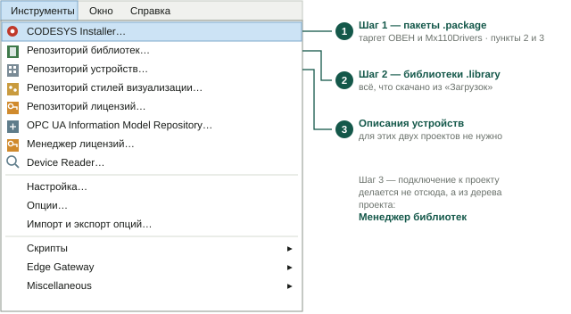
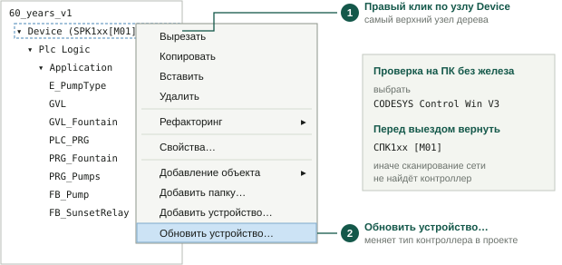
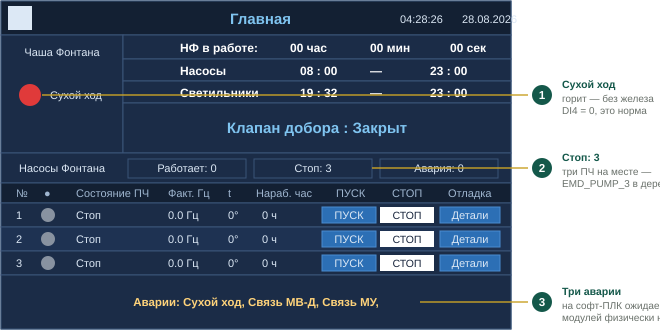

# SETUP — что скачать и что подключить

**Нужен только при настройке нового ПК.** На настроенной машине сразу
в [FIELD_GUIDE.md](FIELD_GUIDE.md); сюда заглядывать, если компиляция
ругается на библиотеку или в списке устройств чего-то нет.

**Железо:** ОВЕН СПК107 [М01], прошивка 2.4
**Среда:** CODESYS V3.5 SP17 Patch 3
**Проекты:** `60-let-oktyabrya/60_years_v1.project` (3 насоса),
`ddyut/Primorskiy_v2.project` (2 насоса)

---

## СКАЧАТЬ — пункты 1–5

### 1. CODESYS V3.5 SP17 Patch 3
Среда программирования. Версия привязана к прошивке 2.4.
https://ftp.owen.ru/CoDeSys3/01_CODESYS/CODESYS_3.5_SP17_Patch3.zip

### 2. OwenTargets-3.5.17.36.package
Таргет-файлы ОВЕН. Без них в списке устройств нет СПК1хх [М01].
https://ftp.owen.ru/CoDeSys3/03_Targets/OwenTargets-3.5.17.36.package

Запасной, если среда просит обновить дерево устройств:
https://ftp.owen.ru/CoDeSys3/03_Targets/OwenTargets-3.5.17.31.package

### 3. Mx110Drivers_v3.5.11.14.package
Шаблоны модулей МВ110-16Д (адрес 1) и МУ110-16Р (адрес 2) на COM1.
Без пакета их нет в списке добавляемых устройств.
https://ftp.owen.ru/CoDeSys3/04_Library/05_3.5.11.5/01_Components/Mx110Drivers_v3.5.11.14.package

### 4. USB_Driver_v.1.5.102.zip
Драйвер USB для СПК. Для связи по Ethernet не нужен.
https://ftp.owen.ru/CoDeSys3/06_SPK_USB_Driver/USB_Driver_v.1.5.102.zip

Рядом лежит `SPK_USB_Driver_1.2.90.exe` со свежей датой, но версия у
него старее. Брать 1.5.102.

### 5. Библиотеки ОВЕН — четыре файла

- [OwenVisuDialogs_v3.5.17.3.library](https://ftp.owen.ru/CoDeSys3/04_Library/05_3.5.11.5/02_Libraries/OwenVisuDialogs_v3.5.17.3.library)
- [OwenVisuTools_v3.5.17.21.library](https://ftp.owen.ru/CoDeSys3/04_Library/05_3.5.11.5/02_Libraries/OwenVisuTools_v3.5.17.21.library)
- [OwenStringUtils_v3.5.4.9.compiled-library](https://ftp.owen.ru/CoDeSys3/04_Library/05_3.5.11.5/02_Libraries/OwenStringUtils_v3.5.4.9.compiled-library)
- [OwenCommunication_v3.5.11.7.compiled-library](https://ftp.owen.ru/CoDeSys3/04_Library/05_3.5.11.5/02_Libraries/OwenCommunication_v3.5.11.7.compiled-library)

Ставить все четыре (шаг 2 ниже). Репозиторий библиотек — склад на
машине, лишнее там не мешает: в проект попадёт только то, что
подключите шагом 3.

---

## ПОДКЛЮЧИТЬ В ПРОЕКТЕ — пункты 6–10

Скачивать не надо, идут с CODESYS. Добавляются в **Менеджер библиотек
проекта**, иначе компиляция ругается на неизвестные типы.

| № | Библиотека | Что даёт |
|---|---|---|
| 6 | **Standard** | `TON`, `TOF`, `R_TRIG`, `CONCAT`, `LEN`, `WCONCAT`, `WLEN`. Обычно уже подключена |
| 7 | **SysTimeRtc** | `SysTimeRtcGet/Set/ConvertUtcToDate`, тип `SYSTIMEDATE` — часы и коррекция RTC |
| 8 | **CAA File** | пространство имён `FILE` — вся запись журналов на SD |
| 9 | **CAA Types Extern** | зависимость CAA File, тянется сама |
| 10 | **VisuElems** | визуализация, добавляется автоматически |

⚠️ `SysTimeRtc` в списке добавления скрыта — нужна кнопка
**«Дополнительно…»**.

⚠️ Дескриптор файла объявлять как `FILE.CAA.HANDLE`, а не `CAA.HANDLE` —
иначе ошибка «ссылка на объект не указывает на экземпляр».

**Modbus COM / Master / Slave** — не библиотеки, а описания устройств:
идут с таргет-пакетом, добавляются в дерево.

Всплывёт при компиляции библиотека, которой здесь нет, — дописать пункт.

---

## КУДА ЧТО ПОДКЛЮЧАЕТСЯ



**Рис. 6.** Первые два шага делаются из меню «Инструменты»

**Шаг 1 — пакеты `.package`** (пункты 2, 3):
```
Инструменты → CODESYS Installer… → Install File… → выбрать файл
```
Перезапустить среду. В списке устройств появятся СПК1хх [М01],
МВ110 и МУ110.

**Шаг 2 — библиотеки ОВЕН** (пункт 5):
```
Инструменты → Репозиторий библиотек… → Установить… → выбрать файл
```
Повторить для всех четырёх файлов.

**Шаг 3 — подключить к проекту** (пункты 5–10):
```
Менеджер библиотек в дереве проекта → Добавить библиотеку… → имя → OK
```

Шаги 1 и 2 — один раз на машину. Шаг 3 — в каждом проекте.

---

## ПЕРВОЕ ОТКРЫТИЕ ПРОЕКТА

Выскочит окно **«Среда проекта» → «Незаданный плейсхолдер»** со
списком библиотек.

→ **Нажать `OK`.** Без разрешения плейсхолдеров проект не соберётся.

→ **Не нажимать «Сделать все новейшими».** Нажали случайно — закрыть
проект **без сохранения** и открыть заново. Успели сохранить — вернуть
файл из git: `git checkout -- <файл проекта>`.

Если следом предложат **обновить версии устройств и библиотек** —
ничего не обновлять.

---

## ПРОВЕРКА ПРОЕКТА НА ПК БЕЗ КОНТРОЛЛЕРА

Тип устройства в дереве переключается на софт-ПЛК **CODESYS Control
Win V3** — он ставится вместе со средой.



**Рис. 7.** Смена типа контроллера в проекте

1. Правый клик по верхнему узлу дерева — `Device`.
2. **«Обновить устройство…»** → выбрать `CODESYS Control Win V3`.
3. Запустить ПЛК: значок Control Win в трее, правый клик →
   **Start PLC**.
4. При первом подключении софт-ПЛК попросит завести пользователя —
   задать любую пару, например `admin` / `admin`, и войти с ней. Это
   учётная запись ПЛК на вашей машине, в проект она не сохраняется.
5. `F11` → `Онлайн → Логин` → `Отладка → Старт`.

**Перед выездом вернуть `СПК1хх [М01]`** тем же способом, иначе
сканирование сети не найдёт контроллер. И не коммитить проект с
Control Win в дереве.

Пути SD (`/mnt/ufs/media/mmcblk0p1`) на Windows не существуют —
журналы на софт-ПЛК не пишутся, это ожидаемо.

Без лицензии Control Win работает **2 часа**, потом останавливается —
перезапустить из трея.

### Как выглядит успешный запуск



**Рис. 8.** Главный экран после успешного запуска на софт-ПЛК

1. **Горит «Сухой ход»** — норма: физического МВ110 нет, DI4 читается
   как 0.
2. **«Стоп: 3»** — все три ПЧ на месте, проект собран правильно.
3. **Три аварии внизу** — «Сухой ход, Связь МВ-Д, Связь МУ». На
   софт-ПЛК ожидаемы: модулей физически нет.

Остальное работает: часы идут, расписание насосов и светильников
показано, время включения света рассчитано астрореле, кнопки доступны.

**Критерий успеха:** экран нарисовался, время идёт, три насоса в
таблице, аварий ровно три и все про отсутствующее железо.

### Сканирование не находит софт-ПЛК

1. В заголовке верхнего узла должно стоять
   `Device (CODESYS Control Win V3)`.
2. Значок Control Win в трее: предлагается `Start PLC` — нажать.
3. Брандмауэр Windows блокирует запросы поиска — временно отключить.

Перезапуск CODESYS обычно не нужен.

---

## ПОРЯДОК УСТАНОВКИ С НУЛЯ

1. Пункт **1** — распаковать, `setup*.exe` от администратора.
2. Перезагрузить ПК (ставится служба CODESYS Gateway).
3. Пункты **2** и **3** — шаг 1. Перезапустить среду.
4. Пункт **4** — драйвер USB. Перезагрузить ПК.
5. Пункт **5** — шаг 2, все четыре файла.
6. Открыть проект, на диалоге плейсхолдеров нажать **OK**.
7. `Менеджер библиотек` — сверить с пунктами **6**–**10**, чего нет
   добавить шагом 3.
8. **F11** → **0 ошибок**.

## ЧЕК-ЛИСТ

- [ ] 1 — CODESYS V3.5 SP17 Patch 3
- [ ] 2 — таргет, СПК1хх [М01] есть в списке устройств
- [ ] 3 — Mx110Drivers, МВ110 и МУ110 есть в списке устройств
- [ ] 4 — драйвер USB
- [ ] 5 — четыре библиотеки ОВЕН в репозитории
- [ ] 6–10 — библиотеки подключены в Менеджере библиотек
- [ ] Проект открывается, **F11** → 0 ошибок

---

## ПО НЕОБХОДИМОСТИ

- **[Конфигуратор М110](https://owen.ru/soft)** — задать адрес и
  скорость модулям, если модуль заменили
- **[Прошивка СПК1хх [М01]](https://ftp.owen.ru/CoDeSys3/10_Firmware/SPK1xx_M01/)**
  — только если среда не логинится из-за версий. Откат невозможен
- **[CODESYS Gateway](https://ftp.owen.ru/CoDeSys3/01_CODESYS/CODESYS%20Gateway%20V3.5SP5Patch5%20Setup.zip)**
  — если значок шлюза в трее серый
- **[CODESYS Installer](https://ftp.owen.ru/CoDeSys3/01_CODESYS/CODESYS%20Installer%202.6.0.0.exe)**
  — если в среде нет пункта `Инструменты → CODESYS Installer`

## ДОКУМЕНТАЦИЯ

**CODESYS:**
[Первый старт](https://ftp.owen.ru/CoDeSys3/11_Documentation/03_3.5.11.5/CDSv3.5_FirstStart_v3.0.pdf) ·
[Modbus](https://ftp.owen.ru/CoDeSys3/11_Documentation/03_3.5.11.5/CDSv3.5_Modbus_v3.2.pdf) ·
[Визуализация](https://ftp.owen.ru/CoDeSys3/11_Documentation/03_3.5.11.5/CDSv3.5_Visu_v3.0.pdf) ·
[FAQ](https://ftp.owen.ru/CoDeSys3/11_Documentation/03_3.5.11.5/CDSv3.5_Faq_v3.7.pdf)

**Железо:**
[EMD-PUMP](https://elhart.ru/drive_technology/pump_frequency_converters/emd-pump.html)
([PDF](https://ftp.totalkip.ru/report.local/re/RE_elhart_7747.pdf)) ·
[МВ110-16Д](https://owen.ru/uploads/171/re_mv110-16d_dn__m01__1-ru-34143-1.14.pdf) ·
[МУ110-16Р](https://www.owenkomplekt.ru/assets/files/mu110-16r/re_mu110-16r_k__m01__2637_1.pdf)

**Каталоги FTP:**
[среда](https://ftp.owen.ru/CoDeSys3/01_CODESYS/) ·
[таргеты](https://ftp.owen.ru/CoDeSys3/03_Targets/) ·
[компоненты](https://ftp.owen.ru/CoDeSys3/04_Library/05_3.5.11.5/01_Components/) ·
[библиотеки](https://ftp.owen.ru/CoDeSys3/04_Library/05_3.5.11.5/02_Libraries/) ·
[прошивки](https://ftp.owen.ru/CoDeSys3/10_Firmware/) ·
[документация](https://ftp.owen.ru/CoDeSys3/11_Documentation/03_3.5.11.5/)
